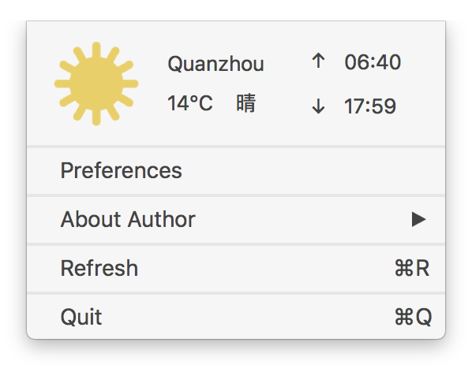

<h1 align="center">Weather For Mac</h1>

# Install It
1. OS X 10.12/Xcode 8.0/Swift 3.0
2. $ git clone --recursive https://github.com/hocgin/WeacherForMac
3. $ pod install
4. open WeacherForMac.xcodeproj

# Has What ? :)
- Status Bar

- Panel

- Preferences

# ISSUES
[New ISSUES](https://github.com/hocgin/WeatherForMac/issues/new)

# Author

# Q&A
- 如何申请`APP ID`?
> 请移步[openweathermap.org](https://home.openweathermap.org/api_keys) 申请, 然后再填入`选项`中

# LICENSE

